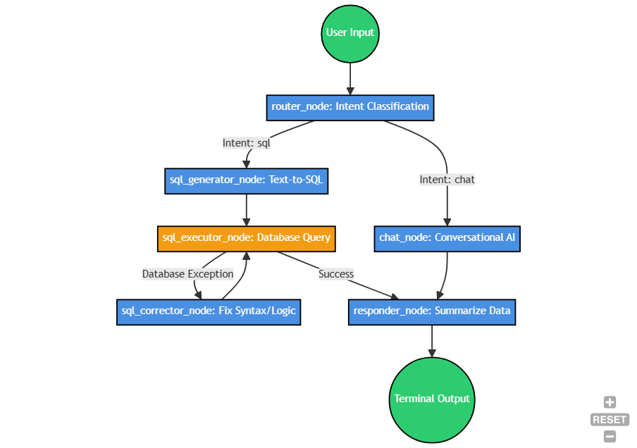

# Space Station Supply Agent (SQL)

A conversational AI agent for managing galactic logistics and station supplies.

## Overview

This agent connects to a relational space station database (SQLite) using a LangGraph-based architecture to convert natural queries into SQL, execute them, handle errors automatically, and summarize the data for the user.



## Features

- **LangGraph Architecture**: State-based routing seamlessly toggles between casual conversation ("chat") and database querying ("sql").
- **Dynamic SQL Generation**: Transforms natural language into precise SQLite database queries using system-injected schemas.
- **Autonomous Error Recovery**: If an LLM generates invalid SQL syntax, a specialized `SQL CORRECTOR` node intercepts the exception and intelligently replans the query up to 3 times before failing gracefully.
- **Hallucination Detection**: Built-in regex guards specifically prevent models from hallucinating mathematical completions or conversational drift during the code generation phases.
- **Token-Optimized Schema**: Uses `PRAGMA` to deeply condense database tables for smaller LLM API contexts.
- **Pure Terminal CLI**: A highly efficient, zero-dependency command line interface.

## Setup

1. **Install dependencies:**

```bash
pip install -r requirements.txt
```

2. **Setup the Database:**

```bash
python setup_database.py
```

3. **Environment Variables:**
   Rename `.env.example` to `.env` and set your preferred provider.

## Running the Agent

```bash
python main.py
```
